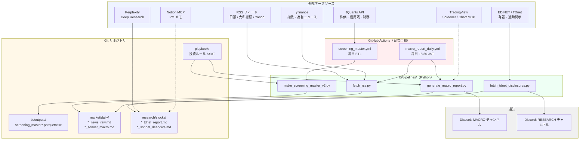
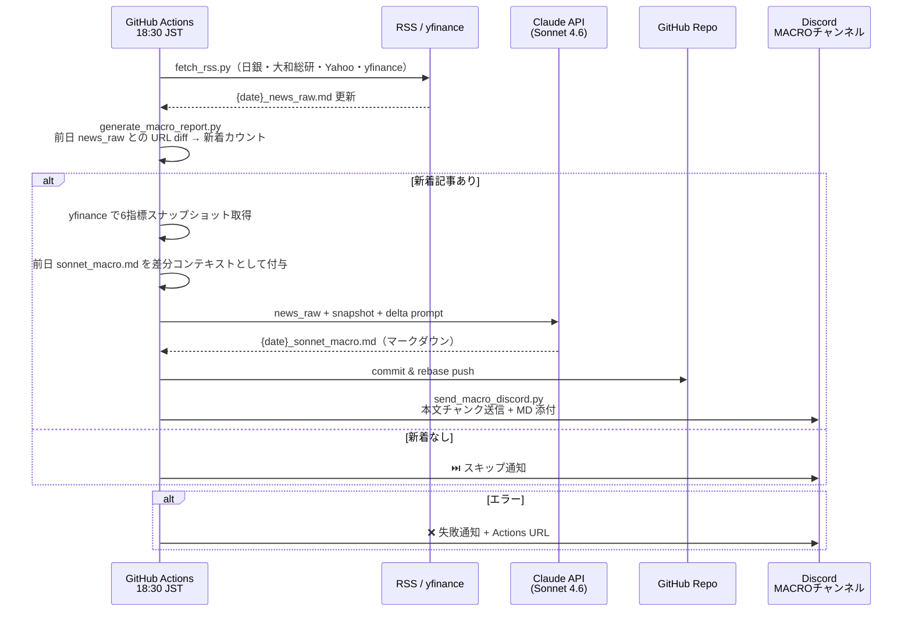
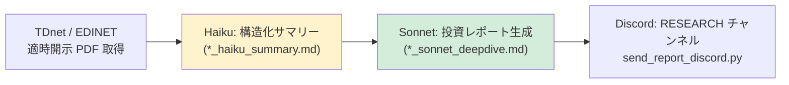

# Mizuki Fund — システム概要（エンジニアレビュー用）

> **この文書の目的**  
> 個人スイングトレーダーの PM が「ヘッジファンドに近い分業＋ルール」を AI エージェントで再現しようとしているプロジェクト。  
> 外部エンジニアに設計・自動化・LLM コスト周りの率直な意見をもらうために書いた。

---

## コンセプト

**`playbook/` で投資ルールを固定し、仮想アナリスト（`agents/*.md`）に役割を割り当てる。**  
データは BI が JQuants / EDINET で ETL し、ニュースは RSS で日次収集、  
深い問いは Claude (Sonnet/Haiku) と Perplexity で回す——という小さな AI 研究工場を、  
Git + GitHub Actions で半自動化している。

---

## 仮想チーム構成

| ロール | 役割 | 主な入出力 |
|--------|------|-----------|
| **PM** | 最終判断・リスク許容 | `portfolio/`、`playbook/` |
| **秘書** | タスク・感情・日次リズム管理 | `context/journal/`、Notion MCP |
| **マクロ経済アナリスト** | 市場全体・マクロ環境の日次レポート | `market/daily/*_sonnet_macro.md` |
| **業界＆個別銘柄アナリスト** | セクター・銘柄深掘り | `research/stocks/` |
| **トレーダー** | エントリー・価格帯アドバイス | `playbook/entry_exit_rules.md` |
| **BI** | ETL・スクリーニング・品質管理 | `bi/pipelines/`、`bi/outputs/` |
| **開発** | ツール・パイプライン改修 | `dev/` |

すべての助言は **`playbook/`**（哲学・スクリーニング基準・リスクルール）に従う。これが唯一の北極星。

---

## 全体アーキテクチャ（現在）

---

## 日次マクロレポートパイプライン（最近の主要実装）

18:30 JST に GitHub Actions が自動実行する完全無人フロー。

### レポートの品質要件（`agents/macro_analyst.md` で明文化）

- **自己完結**: PM は生データを見ない。このレポートだけで投資判断できる水準
- **因果を繋ぐ**: 「何が起きた → なぜ重要か（背景説明込み） → 日本株への影響（★/▼ 7段階）」をトピックごとに完結
- **差分重視**: 前日レポートの冒頭 2,500 字を差分コンテキストとして渡し、変化のないトピックを簡潔化
- **Deep Research 候補**: 「重要だが解像度不足な論点」を末尾に必ずリストアップ

---

## 個別銘柄フロー（Haiku + Sonnet 二段構成）

- **Haiku** でトークンを節約しながら EDINET/TDnet 生データを構造化
- **Sonnet** がサマリーを読んで投資判断用レポートを生成
- 全量を Sonnet に渡すより約 **60〜70% のトークン削減**（推定）

---

## スクリーニングマスター（`make_screening_master_v2.py`）

JQuants から全上場銘柄（約 4,000 社）のデータを取得し、`bi/outputs/screening_master*.parquet` として日次生成。

### 週次時系列列の構造

横持ちで8週分のスナップショットを保持。`WkSeq01`=最古、`WkSeq08`=直近。

| 列グループ | 内容 | 活用例 |
|-----------|------|-------|
| `LongMargin_WkSeq01〜08` | 信用買い残（週次） | トレンド・回転率分析 |
| `ShortMargin_WkSeq01〜08` | 信用売り残（個人） | 空売り圧力の推移 |
| `ShortSale_WkSeq01〜08` | 機関空売り残（週次合計） | 機関の勢い・方向転換検知 |
| `VolAvg5d_BlkSeq01〜08` | 直近5日出来高平均（8ブロック） | 出来高トレンドの確認 |
| `ValAvg5d_BlkSeq01〜08` | 直近5日売買代金平均（8ブロック） | 資金流入・流動性確認 |

機関空売り残は「同一機関の重複カウント防止」のため、週次スナップショットごとに `groupby(Code, inst_key).tail(1)` で最新ポジションのみを集計してから合算。

---

## RSS データソース構成（`ops/rss_config.yaml`）

| フィード | 内容 | LLM 要約 |
|---------|------|---------|
| 日銀（boj） | 金融政策・統計・レビュー論文 | Haiku |
| 大和総研 economics | 日本経済予測・指標速報解説 | Haiku |
| 大和総研 capital-mkt | 市場分析・ガバナンス動向 | Haiku |
| Yahoo ビジネス | 一般ビジネスニュース | なし（生テキスト） |

yfinance で S&P500・日経・ダウ・USD/JPY の英語ニュースを別途取得し、同一 `news_raw.md` に統合。

---

## TradingView MCP（設定済み・テスト段階）

2種類の MCP を `~/.claude/.mcp.json` に登録済み。

| MCP | 方式 | 主な用途 |
|-----|------|---------|
| `tradingview-screener` | Python SDK（HTTP） | 現在値スナップショット・スクリーニング |
| `tradingview-chart` | Node.js + Chrome DevTools Protocol | チャート操作・Pine Script 注入・OHLCV 取得 |

chart MCP は TradingView Desktop 起動が必要（port 9222）。バックテストは現状 TV MCP では不可（JQuants の OHLCV で代替検討中）。

---

## Discord 通知設計

Webhook を2チャンネルに分離。

| チャンネル | 用途 | Secret 名 |
|-----------|------|----------|
| MACRO | 日次マクロレポート・スキップ・エラー通知 | `DISCORD_WEBHOOK_MACRO` |
| RESEARCH | 個別銘柄 Deep Dive レポート | `DISCORD_WEBHOOK_RESEARCH` |

送信方式：本文を 1,900 字チャンクに分割してテキスト送信後、元の `.md` ファイルを添付。Discord の 2,000 字制限と 8MB ファイル制限を考慮。

---

## GitHub Actions 構成

| ワークフロー | スケジュール | 処理内容 |
|------------|------------|---------|
| `screening_master.yml` | 平日 ETL（cron-job.org 外部トリガー） | JQuants → parquet/xlsx 生成 → push |
| `macro_report_daily.yml` | 毎日 18:30 JST | RSS 取得 → Claude でレポート生成 → Discord 送信 |

> **CI trigger の補足**: `screening_master.yml` は JQuants の配信時刻依存のため、GitHub Actions のスケジュールではなく cron-job.org から `workflow_dispatch` で起動。

CI の rebase 戦略：`git rebase origin/master` が parquet 等のバイナリでコンフリクトする場合、`git checkout --theirs` でリモート優先に解決して継続。

---

## コストモデル（マクロレポート自動生成）

| 項目 | 見積もり |
|------|---------|
| Input トークン / 回 | 〜18,000（news_raw 全文 + 前日差分コンテキスト + system prompt） |
| Output トークン / 回 | 〜4,000（レポート本文） |
| 単価（Sonnet 4.6） | $3/MTok (in) + $15/MTok (out) |
| **1回あたり** | **約 $0.11（¥16）** |
| **月額（30回）** | **約 $3.3（¥500）** |

---

## 技術スタック

| レイヤー | 採用技術 |
|---------|---------|
| データ取得 | Python（jquants-api-client、yfinance、feedparser、pdfminer.six、requests） |
| LLM | Claude Sonnet 4.6（レポート生成）/ Haiku 4.5（サマリー・RSS 要約） |
| MCP | TradingView Screener（Python）、TradingView Chart（Node.js）、Notion |
| 通知 | Discord Webhook（テキストチャンク＋ MD 添付） |
| 永続化 | Git + GitHub（parquet / md / xlsx）|
| 自動実行 | GitHub Actions（`schedule` + `workflow_dispatch`）、cron-job.org（外部トリガー） |
| ローカル | Windows 11、PowerShell、bash（CI は Ubuntu） |
| エージェント設計 | `agents/*.md`（システムプロンプト）＋ `playbook/`（投資ルール SSoT） |

---

## 実装済み（できていること）

- [x] 全上場スクリーニングマスタを日次生成・push（JQuants ETL）
- [x] 信用残・機関空売り・出来高・売買代金の8週時系列列（横持ち）
- [x] 日次マクロレポートの完全自動生成＆Discord 送信（毎日 18:30 JST）
- [x] 新着記事なし時の自動スキップ＋Discord 通知
- [x] 前日レポートとの差分コンテキストによる重複抑制
- [x] TDnet 適時開示の自動フェッチ・PDF テキスト抽出（`fetch_tdnet_disclosures.py`）
- [x] Haiku（構造化サマリー）→ Sonnet（投資レポート）の二段構成 Deep Dive
- [x] Discord 通知の MACRO / RESEARCH チャンネル分離
- [x] TradingView Screener MCP によるリアルタイム価格取得（CI フォールバックは yfinance）
- [x] エージェント定義と `playbook/` によるルール固定（越権防止）
- [x] Notion MCP（許可 DB のみ・`CLAUDE.md` で範囲明示）
- [x] CI の binary conflict 対応（`git checkout --theirs` フォールバック）

---

## 詰まっているところ・未解決の設計課題

- [ ] **TradingView Chart MCP の日本株動作確認**（`.T` サフィックスの挙動未検証）
- [ ] **generate_macro_report.py のプロンプト長最適化**（news_raw 全文渡しは \~18k トークン、削れるか？）
- [ ] **EDINET XBRL の欠損・単位ブレのクレンジング方針**（有報によって構造が違う）
- [ ] **個人投資家センチメント収集手段**（Yahoo 掲示板・X の無料 API は実質なし、X Basic は $200/月）
- [ ] **スクリーニング条件の自動適用**（条件は `playbook/stock_criteria.md` にあるが parquet → Claude の接続設計が未整備）
- [ ] **CI 生成レポートの品質担保方法**（インタラクティブ vs バッチの品質差の計測手段がない）

---

## レビューで特に聞きたいこと

1. **プロンプト設計（トークン削減）**  
   前日レポート 2,500 字 + news_raw 全文（〜18k トークン）を毎日渡している。  
   品質を落とさずに削れる部分はどこか（新着 URL だけに絞る？ TF-IDF 的なフィルタ？ 要約の多段化？）

2. **CI レポートの品質担保**  
   Claude Code インタラクティブと `anthropic` Python SDK 経由での生成品質の差をどう計測・管理するか。  
   自動評価（LLM-as-a-judge など）を挟む価値はあるか。

3. **スクリーニング → LLM 接続フォーマット**  
   parquet（4,000 社 × 200 列超）を Claude に渡すのは非現実的。  
   フィルタ済み候補を何形式（CSV サマリー？ YAML？ JSON Lines？）で渡すのがベストか。

4. **CI の rebase 安定性**  
   現在「binary conflict → `--theirs`」で逃げているが、より堅牢なパターンはあるか。  
   `push --force-with-lease` との使い分けの基準は？

5. **Discord 以外の通知 / UI 選択肢**  
   現状 Discord のみ。PM がモバイルで確認しやすい他の手段（Slack / Telegram Bot 等）や、  
   Notion への自動書き込みの是非（MCP で書き込み権限はある）。

---

*仮想チームは紙の組織図ではなく、`agents/` と `playbook/` に効いている。その前提で読んでもらえると嬉しい。*  
*最終更新: 2026-04-05*
