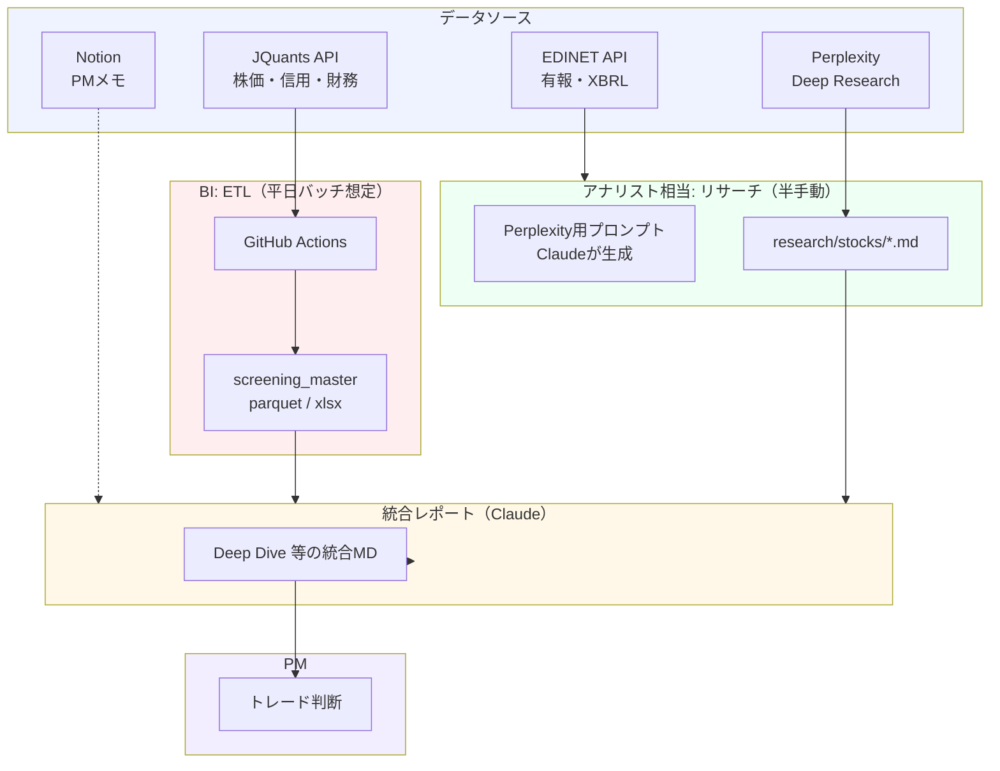
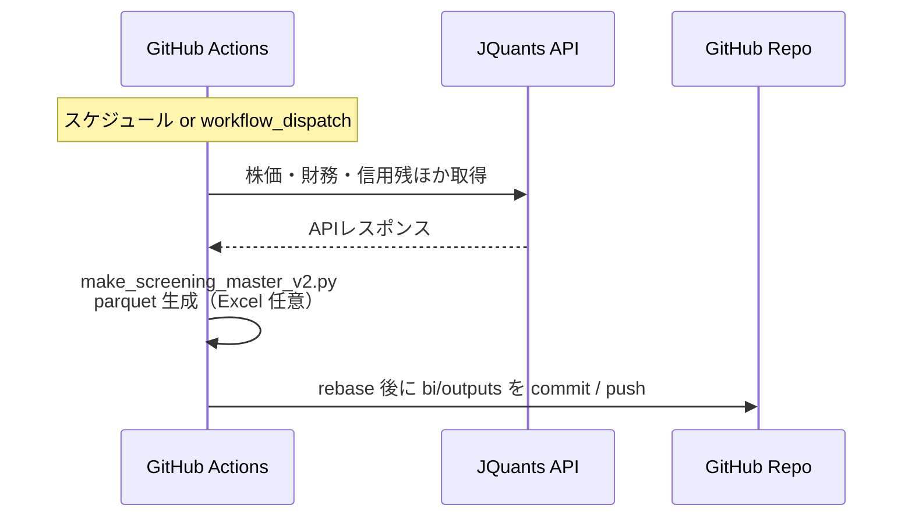
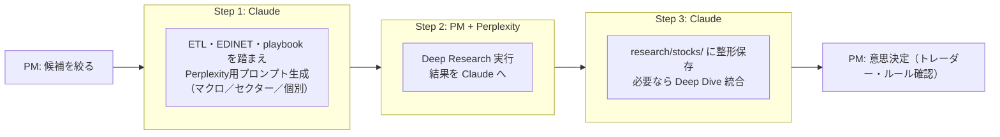
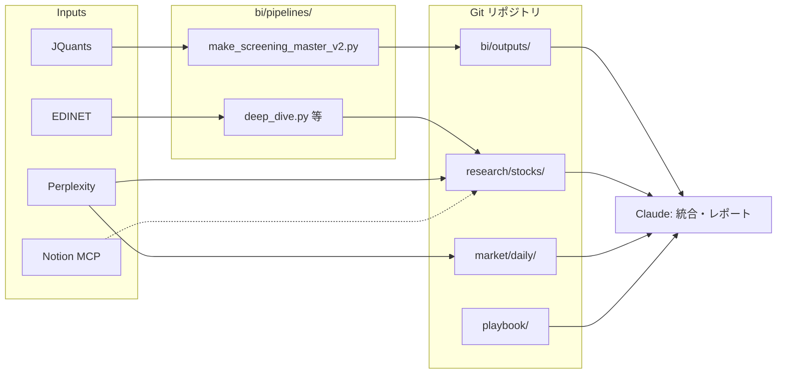

# Mizuki Fund — システム概要（エンジニアレビュー用）

> **この文書の目的**  
> 個人スイングの PM が、**ヘッジファンドに近い「分業＋ルール」**を AI で支えようとしている。その再現方法を、外部エンジニアに静かに見てもらい、**設計・自動化・トークン周り**への指摘を狙い撃ちしたい。

---

## コンセプト（ひと言）

**`playbook/` で投資ルールを固定**し、**仮想アナリスト（`agents/*.md`）** に役割を割り当てる。  
その足元のデータは **BI が J-Quants / EDINET で ETL**、深い問いは **Perplexity と Claude** で回す——という**小さな研究工場**を、Git と GitHub Actions で半自動化している。

---

## 仮想チームとリポジトリの対応

現場の用語は `CLAUDE.md` と各エージェント定義と揃えている。

| ロール | 役割（要約） | 主な参照・出力 |
|--------|--------------|----------------|
| **PM** | 最終判断・リスク許容 | `portfolio/`、`playbook/` |
| **秘書** | タスク・感情・日次リズム | `agents/secretary.md`、`context/journal/` |
| **マクロ経済アナリスト** | 市場全体・マクロ | `agents/macro_analyst.md`、`market/` |
| **業界＆個別銘柄アナリスト** | セクター・銘柄深掘り | `agents/sector_analyst.md`、`research/` |
| **トレーダー** | エントリー・価格帯 | `agents/trader.md`、`playbook/entry_exit_rules.md` |
| **BI** | ETL・スクリーニング・品質 | `agents/bi.md`、`bi/pipelines/`、`bi/outputs/` |
| **開発** | ツール・パイプライン改修 | `agents/developer.md`、`dev/` |

**守るべき北極星：** すべての助言は **`playbook/`**（哲学・スクリーニング・リスク）に従う。コードもエージェントも、ここを越えない。

---

## 全体アーキテクチャ

---

## 日次 ETL フロー（自動）

**BI が捌く成果物の例：** `screening_master*.parquet`、対応 `xlsx`、必要に応じて `*_data_gaps*`、`yfinance_audit*`。  
**信用買いの週次:** 既定では複数週を **`LongMargin_WkSeq01`（古い）〜 `WkSeq08`（直近）** として横持ちし、トレンド検証用に **`playbook/stock_criteria.md`** の考え方（買残÷発行株、÷出来高、トレンド）と照らせる形にしている。

**運用上のメモ：**
- Actions 内では ETL 後に作業ツリーが汚れるため、`git rebase` だけだと失敗することがある。**`git rebase --autostash origin/master`** でローカル変更を一時退避してから同期する想定。

---

## 個別銘柄リサーチフロー（半手動）

**いま相談したい論点（①）：** Perplexity 長文（数万トークン級）を毎回そのまま突っ込むと、**コンテキストが重すぎる**。  
どこで **構造化サマリー（YAML/JSON）** に落とすか、あるいは **チャンク＋要約** にするか——設計上のベストが欲しい。

---

## データフローとファイルの置き場

ルールの一次ソースは **`playbook/`**（例: `philosophy.md`、`stock_criteria.md`、`strategy.md`）。`investment_framework.md` などもここに随時置いている。

---

## 技術スタック（俯瞰）

| レイヤー | 採用 |
|----------|------|
| データ取得 | Python（jquants、pandas、pyarrow、requests、PDF/XBRL 周り） |
| 永続化 | Git + GitHub（parquet / md / xlsx） |
| 自動実行 | GitHub Actions（スケジュール・手動 dispatch） |
| LLM / 調査 | Claude（Code / MCP）、Perplexity Deep Research |
| 外部 API | JQuants、EDINET、Notion（MCP で範囲限定） |
| ローカル | Windows 11、PowerShell、`bi/pipelines/ops/` の運用スクリプト |

---

## できていること

- [x] **BI:** 全上場スクリーニングのマスタを日次生成し、リポジトリへ反映（既定ワークフロー）
- [x] **BI:** EDINET から有報相当を取り、MD 化する経路（`deep_dive.py` ほか）
- [x] **リサーチ:** マクロ／セクター／個別の 3 層を Perplexity で回し、Claude で束ねる運用
- [x] **PM 支援:** Notion MCP（許可 DB のみ）
- [x] **ガバナンス:** `playbook/` と `agents/` で「誰が何を言ってよいか」を固定

## いま詰まりやすいところ

- [ ] **トークン設計:** 長文レポートの取り込み方（サマリー化の境界・要否 of ベクトル DB）
- [ ] **信用残:** 週次列（`WkSeq*`）の本番データでの安定性・欠損週の解釈
- [ ] **EDINET:** XBRL 欠損・単位のブレへのクレンジング方針
- [ ] **オーケストレーション:** Claude Code 対話中心 → CLI / バッチへの寄せどころ
- [ ] **補助データ:** ニュース API など、まだパイプライン未接続

---

## レビューを特に欲しいポイント

1. **トークン効率**  
   入力をどこまで構造化すべきか。サマリー生成をパイプラインに挟む vs レポート時だけ要約、の線引き。

2. **自動化の次の一歩**  
   Perplexity → 保存 → 統合レポートを、API コストと信頼性のトレードオフでどこまで無人化するか。

3. **データ品質**  
   J-Quants / yfinance 補完 / XBRL の三つ巴での欠損・単位の扱いのベストプラクティス。

4. **CI の単純化**  
   `workflow_dispatch` や外部 cron に頼らず、GitHub だけで十分なスケジュールに寄せられるか。

---

*— 仮想チームは紙の組織図ではなく、`agents/` と `playbook/` に効いている。その前提で読んでもらえると嬉しい。*
